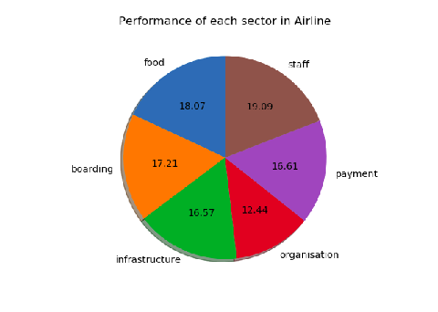
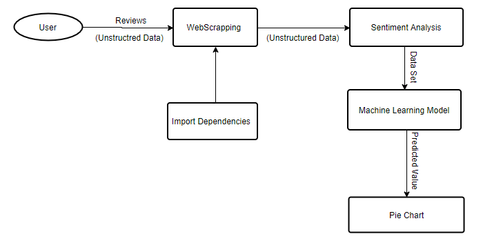

# Airline-Review-Sentiment-Analysis
This system depicts how sentimental analysis can be appealed to airlines recommendation systems to make ideal suggestions.

## Table of contents
* [General info](#general-info)
* [Technologies](#technologies)
* [Features](#features)
* [Screenshots](#screenshots)
* [Contact](#contact)

## General info
Every  day  massive  amount  of  data  is  generated  by  social  media  users  which  can  be  usedto  analyze  their  opinion  about  any  event,  movie,  product  or  politics.Passengers  and  otherinterested parties are able to send messages through a variety of means to express their opinionsand perceptions on Airline services on the web.  Analyzing individual postings manually is adaunting task and it is almost impossible.  Specific methods and algorithms are required toprocess these opinions to extract useful information and patterns. The system depicts how sentimental analysiscan be appealed to airlines recommendation systems to make ideal suggestions.

In this case i used airline reviews to extract their emotions.Then performan intelligent processing technique to extract the true meanings of the people’s comments andto decide and classify them in terms of positive, negative or neutral thus to know the majorityof people like or dislike the desired sector of the airline. So at the end you will get an integer sentiment value for each sector. and business can understand which sector(eg: food, staff etc.) needs improvement

## Technologies
 Python 3.6
 NLTK
 NumPy
 Scikit-learn
 Pandas 
 Flask

  ## Features
List of features ready aare as follows:
* User can login to the system and give the link to the  review page and find the detailed sentiment analysis of that particular comments.

## Screenshots

## Contact
created by [@justinseby] - feel free to contact me

